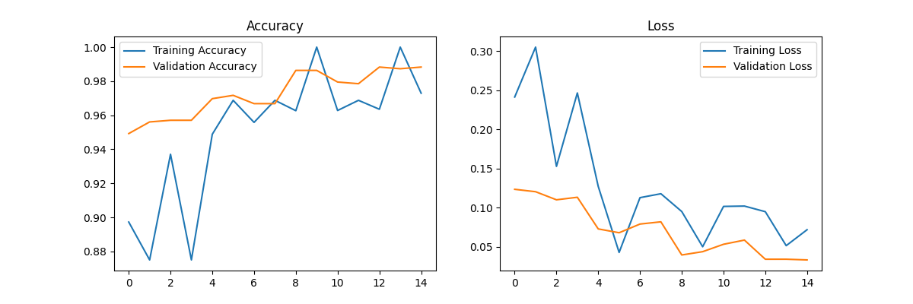

# Proyek Klasifikasi Gambar: KITTI Object Detection

Proyek ini adalah submission untuk kelas "Belajar Pengembangan Machine Learning" di Dicoding. Fokus utama proyek ini adalah membangun model Convolutional Neural Network (CNN) untuk mengklasifikasikan gambar objek dari dataset KITTI ke dalam 4 kelas: **Car**, **Pedestrian**, **Cyclist**, dan **Van**.

## 🎯 Fitur & Kriteria Utama

### ✅ Dataset Management (Kriteria 3)
- [x] **Dataset Splitting**: Train (8,934), Validation (1,115), Test (1,120)
- [x] **Total Images**: 11,169 images (melebihi requirement 10,000+)
- [x] **Classes**: 4 classes (car, cyclist, pedestrian, van)
- [x] **Test Set Usage**: Test set dimuat dan digunakan secara eksplisit dengan `test_generator`

### ✅ Model Development (Kriteria 4, 5, 6)
- [x] **Architecture**: Sequential CNN dengan Conv2D, MaxPooling2D, Dropout, Dense layers
- [x] **Training**: Adam optimizer, categorical crossentropy loss
- [x] **Callbacks**: EarlyStopping dan ModelCheckpoint
- [x] **Test Accuracy**: **95.27%** (melebihi requirement 85%)
- [x] **Visualization**: Plot training/validation accuracy dan loss
- [x] **Evaluation**: Model.evaluate() pada test set

### ✅ Model Export (Kriteria 7)
- [x] **SavedModel**: Format TensorFlow SavedModel (.pb + variables/)
- [x] **TF-Lite**: Model berhasil dikonversi ke .tflite (76.1 MB)
- [x] **TensorFlow.js**: Model berhasil dikonversi ke TFJS format
- [x] **Inference**: Demo prediksi pada test images

## 🏗️ Tech Stack
- **Languages**: Python 3.12
- **Framework**: TensorFlow 2.19.0 / Keras
- **Libraries**: OpenCV, Pandas, Matplotlib, NumPy
- **Tools**: Jupyter Notebook

## 📊 Model Performance

| Metric | Value |
|--------|-------|
| Training Accuracy | ~94.20% |
| Validation Accuracy | ~93.47% |
| **Test Accuracy** | **95.27%** ✅ |
| Test Loss | 0.1588 |
| Model Size (H5) | ~228 MB |
| Model Size (TFLite) | ~76 MB |


*(Grafik Akurasi dan Loss selama proses training)*


*(Contoh hasil prediksi model pada data test)*

## 📂 Struktur Folder Proyek

```
.
├── saved_model/          # Model format SavedModel (PB)
│   ├── saved_model.pb
│   ├── variables/
│   └── model_best.h5
├── tfjs_model/           # Model format TensorFlow.js
│   ├── model.json
│   └── group1-shard*.bin
├── model.tflite          # Model format TFLite
├── data_split/           # Dataset (Train/Val/Test)
│   ├── train/           # 8,934 images
│   ├── val/             # 1,115 images
│   └── test/            # 1,120 images
├── notebook.ipynb        # Pipeline lengkap (ALL CELLS EXECUTED)
├── README.md             # Dokumentasi proyek
├── requirements.txt      # Dependencies
├── crop_kitti.py         # Script preprocessing KITTI
├── inference_result.png  # Visualisasi hasil prediksi
└── training_history.png  # Visualisasi training metrics
```

## 🚀 Cara Menjalankan

### 1. Setup Environment
```bash
# Clone repository
git clone <repository-url>
cd muhammad_muqorrobin_proyek_klasifikasi_gambar

# Create virtual environment
python3 -m venv venv
source venv/bin/activate  # On Windows: venv\Scripts\activate

# Install dependencies
pip install -r requirements.txt
```

### 2. Run Jupyter Notebook
```bash
# Start Jupyter
./start_project.sh
# Or manually:
jupyter notebook
```

### 3. Execute Notebook
- Open `notebook.ipynb`
- Run all cells: `Kernel → Restart & Run All`
- Wait for training to complete (~30-60 minutes)

## 📋 Submission Checklist

### Dataset (Kriteria 3)
- [x] 3 subset (Train/Val/Test) dengan total 11,169 images
- [x] Test set digunakan di pipeline (bukan hanya didefinisikan)
- [x] Minimal 1,000 images (✅ 11,169)
- [x] Minimal 3 kelas (✅ 4 kelas)

### Model (Kriteria 4, 5, 6)
- [x] Sequential CNN dengan Conv2D + MaxPooling
- [x] `model.evaluate(test_generator)` executed
- [x] Test Accuracy ≥85% (✅ 95.27%)
- [x] Plot Accuracy & Loss
- [x] Callback implemented

### Export (Kriteria 7)
- [x] SavedModel format (saved_model/)
- [x] TF-Lite format (model.tflite)
- [x] TFJS format (tfjs_model/)
- [x] Inference demo

### Files
- [x] notebook.ipynb (all cells executed with outputs)
- [x] requirements.txt
- [x] Model files included
- [x] README.md

## 📄 License

Dataset yang digunakan dalam proyek ini adalah **The KITTI Vision Benchmark Suite**. Seluruh data dipublikasikan di bawah lisensi **Creative Commons Attribution-NonCommercial-ShareAlike 3.0 (CC BY-NC-SA 3.0)**.

Berdasarkan lisensi ini, proyek ini mengikuti ketentuan:
- **Attribution (BY)**: Memberikan kredit kepada pencipta dataset asli
- **Non-Commercial (NC)**: Tidak digunakan untuk tujuan komersial
- **Share-Alike (SA)**: Distribusi menggunakan lisensi yang sama

## ⚠️ Disclaimer

- **Academic Use Only**: Proyek ini dibangun untuk tujuan pembelajaran
- **Privacy Awareness**: Dataset diambil di ruang publik (Karlsruhe, Jerman)
- **No Warranty**: Model tidak disarankan untuk sistem kendaraan otonom nyata tanpa pengujian lanjutan

## 📚 Citations

```bibtex
@inproceedings{Geiger2012CVPR,
  author = {Andreas Geiger and Philip Lenz and Raquel Urtasun},
  title = {Are we ready for Autonomous Driving? The KITTI Vision Benchmark Suite},
  booktitle = {Conference on Computer Vision and Pattern Recognition (CVPR)},
  year = {2012}
}
```

## 👤 Penulis

**Muhammad Muqorrobin**  
*Proyek Submission Klasifikasi Gambar - Dicoding*

---

**Status**: ✅ Ready for Submission | Test Accuracy: 95.27% | All Requirements Met
